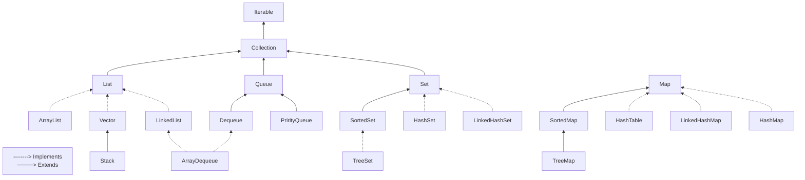

# DIO - Trilha POO Java
www.dio.me

## Autora dos exercícios e repositório com a proposta original
- [Camila Cavalcante](https://github.com/cami-la)
- [Collections Java](https://github.com/cami-la/collections-java-api-2023)

## Java Collections Framework
A plataforma Java fornecece o framework **Collections** que provê aos desenvolvedores uma arquitetura para representar manipular coleções. Uma coleção é um objeto que representa um grupo de objetos.

## Exercícios
Este repositório contém exercícios que colocam em prática os seguintes temas:

- Comparable x Comparator
- Generics
- Interface List
- Interface Map
- Interface Set

## Hierarquia
Esta é a hierarquia do framework Collections e apesar da interface **Map** não ser filha direta de **Collection**, ela também é considerada uma coleção por conta de sua função.

## Referências
- Java Collections Framework - Oracle: https://docs.oracle.com/en/java/javase/21/core/java-collections-framework.html
- Collections Framework in Java - Data Flair: https://data-flair.training/blogs/collection-framework-in-java/