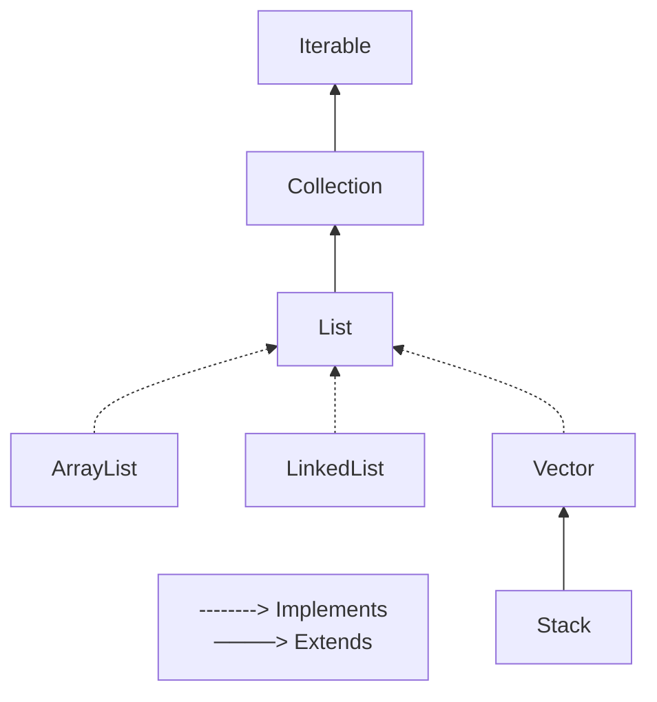

# List Interface

 `List` é uma coleção ordenada (também conhecida como sequência) que permite elementos duplicados. O usuário dessa interface tem controle preciso sobre o local de inserção do elemento na lista. O usuário pode acessar elementos pelo índice Integer deles (posição na lista), e pesquisar por elementos na lista.

As implementações gerais de List são:

- `ArrayList`: implementação de array redimensionável da interface List. Implementa todas as operações de lista opcionais, e permite todos os elementos, incluindo null. Além de implementar a interface List, essa classe fornece métodos para manipular o tamanho do array que é usado internamente para armazenar a lista.

- `LinkedList`: implementação de lista duplamente vinculada da interface List. Implementa todas as operações de lista opcionais, e permite todos os elementos (incluindo null). Operações que indexama na lista percorrerão a lista do início ou do fim, o que estiver mais próximo do índice especificado.

- `Vector`: implementa um array aumentável de objetos. Como um array, contém componentes que podem ser acessados usando um índice Integer. Contudo, o tamanho de um Vector pode aumentar ou diminuir conforme necessário para acomodar a adição e remoção de itens após a criação do Vector.

## Exercícios
- Operações Básicas com List
- Pesquisa em List
- Ordenação em List

## Operações Básicas com List
### 1. Lista de Tarefas
Crie uma classe chamada `ListaTarefas` que possui uma lista de tarefas como atributo. Cada tarefa é representada por uma classe chamada `Tarefa` que possui um atributo de descrição. Implemente os seguintes métodos:

- `adicionarTarefa(String descricao)`: adiciona uma nova tarefa à lista com a descrição fornecida;

- `removerTarefa(String descricao)`: remove uma tarefa da lista com base em sua descrição;

- `obterNumeroTotalTarefas()`: retorna o número total de tarefas na lista;

- `obterDescricoesTarefas()`: imprime a descrição de todas as tarefas na lista.

### 2. Carrinho de Compras
Crie uma classe chamada `CarrinhoDeCompras` que represente um carrinho de compras online. O carrinho deve ser implementado com uma lista de itens como atributo. Cada item é representado por uma classe chamada `Item` que possui atributos como nome, preço e quantidade. Implemente os seguintes métodos:

- `adicionarItem(String nome, double preco, int quantidade)`: adiciona um item ao carrinho com o nome, preço e quantidade especificados;

- `removerItem(String nome)`: remove um item do carrinho com base no seu nome;

- `calcularValorTotal()`: calcula e retorna o valor total do carrinho, levando em consideração o preço e a quantidade de cada item;

- `exibirItens()`: exibe todos os itens presentes no carrinho, mostrando seus nomes, preços e quantidades.

## Pesquisa em List
### 1. Catálogo de Livros
Crie uma classe chamada `CatalogoLivros` que possui uma lista de objetos do tipo `Livro` como atributo. Cada livro possui atributos como título, autor e ano de publicação. Implemente os seguintes métodos:

- `adicionarLivro(String titulo, String autor, int anoPublicacao)`: adiciona um livro ao catálogo;

- `pesquisarPorAutor(String autor)`: pesquisa livros por autor e retorna uma lista com os livros encontrados;

- `pesquisarPorIntervaloAnos(int anoInicial, int anoFinal)`: pesquisa livros publicados em um determinado intervalo de anos e retorna uma lista com os livros encontrados;

- `pesquisarPorTitulo(String titulo)`: pesquisa livros por título e retorna o primeiro livro encontrado.

### 2. Soma de Números
Crie uma classe chamada `SomaNumeros` que possui uma lista de números inteiros como atributo. Implemente os seguintes métodos:

- `adicionarNumero(int numero)`: adiciona um número à lista de números;

- `calcularSoma()`: calcula a soma de todos os números na lista e retorna o resultado;

- `encontrarMaiorNumero()`: encontra o maior número na lista e retorna o valor;

- `encontrarMenorNumero()`: encontra o menor número na lista e retorna o valor;

- `exibirNumeros()`: imprime todos os números presentes na lista.

## Ordenação em List
### 1. Ordenação de Pessoas
Crie uma classe chamada `OrdenacaoPessoas` que possui uma lista de objetos do tipo `Pessoa` como atributo. Cada pessoa possui atributos como nome, idade e altura. Implemente os seguintes métodos:

- `adicionarPessoa(String nome, int idade, double altura)`: adiciona uma pessoa à lista;

- `ordenarPorIdade()`: ordena as pessoas da lista por idade usando a interface Comparable;

- `ordenarPorAltura()`: ordena as pessoas da lista por altura usando um Comparator personalizado.

### 2. Ordenação de Números
Crie uma classe chamada `OrdenacaoNumeros` que possui uma lista de números inteiros como atributo. Implemente os seguintes métodos:

- `adicionarNumero(int numero)`: adiciona um número à lista;

- `ordenarAscendente()`: ordena os números da lista em ordem ascendente usando a interface Comparable e a class Collections;

- `ordenarDescendente()`: ordena os números da lista em ordem descendente usando um Comparable e a class Collections.

## Referências
- Interface List - Oracle: https://docs.oracle.com/javase/8/docs/api/java/util/List.html
- Class ArrayList - Oracle: https://docs.oracle.com/javase/8/docs/api/java/util/ArrayList.html
- Class LinkedList - Oracle: https://docs.oracle.com/javase/8/docs/api/java/util/LinkedList.html
- Class Vector - Oracle: https://docs.oracle.com/javase/8/docs/api/java/util/Vector.html