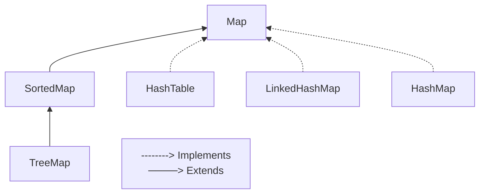

# Map Interface
`Map` é uma interface que mapeia valores para chaves. Um Map não pode conter chaves duplicadas, cada chave mapeia apenas um valor.

As implementações gerais de Map são:

- `HashTable`: implementa uma tabela de hash, que mapeia chaves para valores. Qualquer valor null pode ser usado como chave ou valor.
- `HashMap`: implementação da interface Map baseada em tabela de hash. Esta implementação provê todas as operações opcionais de Map e permite valores e chaves nulos.
- `LinkedHashMap`: implementação de tabela de hash e lista vinculada da interface Map, com ordem de iteração previsível. É uma implementação que define a ordem de iteração que normalmente é a ordem que as chaves foram inseridas no map.

## Exercícios
- Operações Básicas com Map
- Pesquisa em Map
- Ordenação em Map

## Operações Básicas com Map
### 1. Agenda de Contatos
Crie uma classe chamada `AgendaContatos` que utilize um Map para armazenar os contatos. Cada contato possui um nome como chave e um número de telefone como valor. Implemente os seguintes métodos:

- `adicionarContato(String nome, Integer telefone)`: adiciona um contato à agenda, associando o nome do contato ao número de telefone correspondente;
- `removerContato(String nome)`: remove um contato da agenda, dado o nome do contato;
- `exibirContatos()`: exibe todos os contatos da agenda, mostrando o nome e o número de telefone de cada contato;
- `pesquisarPorNome(String nome)`: pesquisa um contato pelo nome e retorna o número de telefone correspondente.

### 2. Dicionário
Crie uma classe chamada `Dicionario` que utilize um Map para armazenar palavras e suas respectivas definições. Implemente os seguintes métodos:

- `adicionarPalavra(String palavra, String definicao)`: adiciona uma palavra e sua definição ao dicionário, associando a palavra à sua definição correspondente;
- `removerPalavra(String palavra)`: remove uma palavra do dicionário, dado o termo a ser removido;
- `exibirPalavras()`: exibe todas as palavras e suas definições do dicionário, mostrando cada palavra seguida de sua respectiva definição;
- `pesquisarPorPalavra(String palavra)`: pesquisa uma palavra no dicionário e retorna sua definição correspondente.

## Pesquisa em Map
### 1. Estoque de Produtos com Preço
Crie uma classe chamada `EstoqueProdutos` que utilize um Map para armazenar os produtos, suas quantidades em estoque e seus respectivos preços. Cada produto possui um código como chave e um objeto `Produto` como valor, contendo nome, quantidade e preço. Implemente os seguintes métodos:

- `adicionarProduto(long codigo, String nome, int quantidade, double preco)`: adiciona um produto ao estoque, juntamente com a quantidade disponível e o preço;
- `exibirProdutos()`: exibe todos os produtos, suas quantidades em estoque e preços;
- `calcularValorTotalEstoque()`: calcula e retorna o valor total do estoque, considerando a quantidade e o preço de cada produto;
- `obterProdutoMaisCaro()`: retorna o produto mais caro do estoque, ou seja, aquele com o maior preço;
- `obterProdutoMaisBarato()`: retorna o produto mais barato do estoque, ou seja, aquele com o menor preço;
- `obterProdutoMaiorValorTotalNoEstoque()`: retorna o produto que possui o maior valor total no estoque (quantidade * preço).

### 2. Contagem de Palavras
Crie uma classe chamada `ContagemPalavras` que utilize um Map para armazenar as palavras e a quantidade de vezes que cada palavra aparece em um texto. Implemente os seguintes métodos:

- `adicionarPalavra(String palavra, Integer contagem)`: adiciona uma palavra à contagem;
- `removerPalavra(String palavra)`: remove uma palavra da contagem, se estiver presente;
- `exibirContagemPalavras()`: exibe todas as palavras e suas respectivas contagens;
- `encontrarPalavraMaisFrequente()`: encontra a palavra mais frequente no texto e retorna a palavra.

## Ordenação em Map
### 1. Agenda de Eventos
Crie uma classe chamada `AgendaEventos` que utilize um Map para armazenar as datas e seus respectivos Eventos. Cada evento é representado por um objeto da classe `
Evento`
, que possui atributos como nome do evento e o nome da atração. Implemente os seguintes métodos:

- `adicionarEvento(LocalDate data, String nome, String atracao)`: adiciona um evento à agenda;
- `exibirAgenda()`: exibe a agenda de eventos em ordem crescente de data;
- `obterProximoEvento()`: retorna o próximo evento que ocorrerá.

### 2. Livraria Online
Crie uma classe chamada `LivrariaOnline` que representa uma livraria online. Essa classe utiliza um Map para armazenar os livros disponíveis na livraria, utilizando o link da obra na Amazon Marketplace como chave e um objeto da classe `Livro` como valor. A classe Livro possui atributos como título, autor e preço. Implemente os seguintes métodos:

- `adicionarLivro(String link, String titulo, String autor, double preco)`: adiciona um livro à livraria, utilizando o ISBN como chave no Map;
- `removerLivro(String titulo)`: remove um livro da livraria, dado o titulo do livro;
- `exibirLivrosOrdenadosPorPreco()`: exibe os livros da livraria em ordem crescente de preço;
- `exibirLivrosOrdenadosPorAutor()`: exibe os livros da livraria em ordem alfabética baseado nos nomes dos autores;
- `pesquisarLivrosPorAutor(String autor)`: retorna uma lista de todos os livros escritos por um determinado autor;
- `obterLivroMaisCaro()`: retorna o livro mais caro disponível na livraria;
- `obterLivroMaisBarato()`: retorna o livro mais barato disponível na livraria.

## Referências
- Interface Map - Oracle: https://docs.oracle.com/javase/8/docs/api/java/util/Map.html
- Class HashMap - Oracle: https://docs.oracle.com/javase/8/docs/api/java/util/HashMap.html
- Class LinkedHashMap - Oracle: https://docs.oracle.com/javase/8/docs/api/java/util/LinkedHashMap.html
- Class HashTable - Oracle: https://docs.oracle.com/javase/8/docs/api/java/util/Hashtable.html