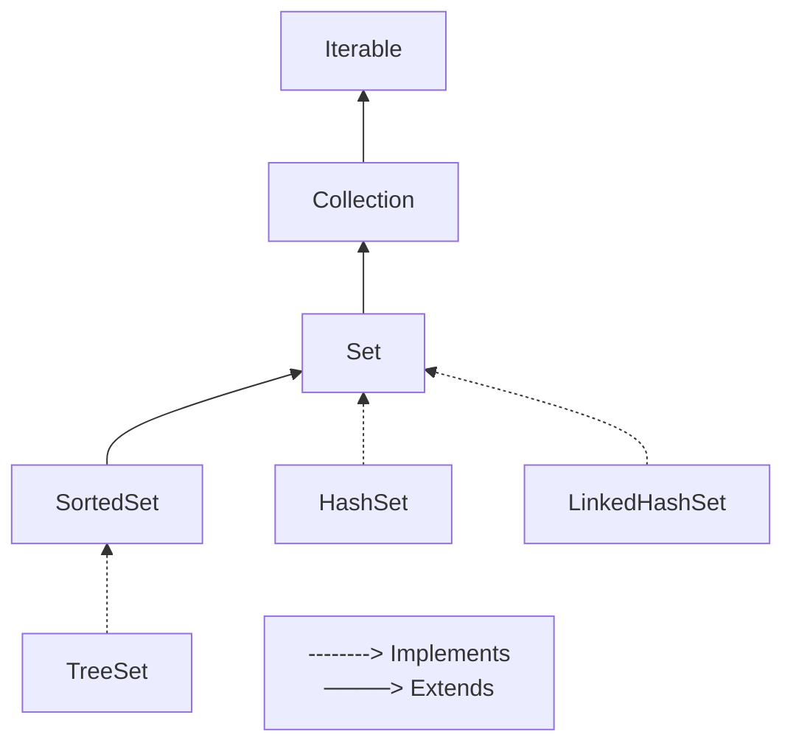

# Set Interface
`Set` é uma coleção que não contém elementos duplicados. Algumas implementações de set possuem restrições sobre os elementos que elas podem conter. Por exemplo, há implementações que proíbem elementos nulos ou têm restrições acerca do tipo dos seus elementos.

As implementações gerais de Set são:

- `SortedSet`: implementação da interface Set que fornece ainda uma ordenação total em seus elementos. Os elementos são ordenados usando a ordem natural deles, ou por um Comparator tipicamente fornecido na criação do conjunto.
- `HashSet`: esta classe implementa a interface Set apoiada por uma instância de HashMap. Não garante a ordem de iteração; particularmente, não garante que a ordem permanecerá constante ao longo do tempo. Permite elementos nulos.
- `LinkedHashSet`: implementação de tabela de hash e lista vinculada da interface Set, com ordem de iteração previsível. Esta implementação difere da HashSet porque mantém uma lista duplamente vinculada executando todas as suas entradas.

## Exercícios
- Operações Básicas com Set
- Pesquisa em Set
- Ordenação em Set

## Operações Básicas com Set
### 1. Conjunto de Convidados
Crie uma classe chamada `ConjuntoConvidados` que possui um conjunto de objetos do tipo `Convidado` como atributo. Cada convidado possui atributos como nome e código do convite. Implemente os seguintes métodos:

- `adicionarConvidado(String nome, int codigoConvite)`: adiciona um convidado ao conjunto;
- `removerConvidadoPorCodigoConvite(int codigoConvite)`: remove um convidado do conjunto com base no código do convite;
- `contarConvidados()`: conta o número total de convidados no Set;
- `exibirConvidados()`: exibe todos os convidados do conjunto.

### 2. Conjunto de Palavras Únicas
Crie uma classe chamada `ConjuntoPalavrasUnicas` que possui um conjunto de palavras únicas como atributo. Implemente os seguintes métodos:

- `adicionarPalavra(String palavra)`: adiciona uma palavra ao conjunto;
- `removerPalavra(String palavra)`: remove uma palavra do conjunto;
- `verificarPalavra(String palavra)`: verifica se uma palavra está presente no conjunto;
- `exibirPalavrasUnicas()`: exibe todas as palavras únicas do conjunto.

## Pesquisa em Set
### 1. Agenda de Contatos
Crie uma classe chamada `AgendaContatos` que possui um conjunto de objetos do tipo `Contato` como atributo. Cada contato possui atributos como nome e número de telefone. Implemente os seguintes métodos:

- `adicionarContato(String nome, int numero)`: adiciona um contato à agenda;
- `exibirContatos()`: exibe todos os contatos da agenda;
- `pesquisarPorNome(String nome)`: pesquisa contatos pelo nome e retorna uma conjunto com os contatos encontrados;
- `atualizarNumeroContato(String nome, int novoNumero)`: atualiza o número de telefone de um contato específico.

### 2. Lista de Tarefas
Crie uma classe chamada `ListaTarefas` que possui um conjunto de objetos do tipo `Tarefa` como atributo. Cada tarefa possui um atributo de descrição e um atributo boolean para indicar se a tarefa foi concluída ou não. Implemente os seguintes métodos:

- `adicionarTarefa(String descricao)`: adiciona uma nova tarefa ao Set.
- `removerTarefa(String descricao)`: remove uma tarefa do Set de acordo com a descrição, se estiver presente;
- `exibirTarefas()`: exibe todas as tarefas da lista de tarefas;
- `contarTarefas()`: conta e retorna o número total de tarefas na lista de tarefas;
- `obterTarefasConcluidas()`: retorna um Set com as tarefas concluídas;
- `obterTarefasPendentes()`: retorna um Set com as tarefas pendentes;
- `marcarTarefaComoConcluida(String descricao)`: marca uma tarefa como concluída de acordo com a descrição;
- `marcarTarefaComoPendente(String descricao)`: marca uma tarefa como pendente de acordo com a descrição;
- `limparListaTarefas()`: remove todas as tarefas da lista de tarefas.

## Ordenação em Set
### 1. Cadastro de Produtos
Crie uma classe chamada `CadastroProdutos` que possui um conjunto de objetos do tipo `Produto` como atributo. Cada produto possui atributos como nome, cod, preço e quantidade. Implemente os seguintes métodos:

- `adicionarProduto(long codigo, String nome, double preco, int quantidade)`: adiciona um produto ao cadastro;
- `exibirProdutosPorNome()`: exibe todos os produtos do cadastro em ordem alfabética pelo nome;
- `exibirProdutosPorPreco()`: exibe todos os produtos do cadastro em ordem crescente de preço.

### 2. Lista de Alunos
Crie uma classe chamada `GerenciadorAlunos` que irá lidar com uma lista de alunos. Crie outra classe chamada `Aluno` para representar cada aluno. Ela terá atributos como nome, matrícula e nota. Implemente os seguintes métodos:

- `adicionarAluno(String nome, Long matricula, double media)`: adiciona um aluno ao conjunto;
- `removerAluno(long matricula)`: remove um aluno ao conjunto a partir da matricula, se estiver presente;
- `exibirAlunosPorNome()`: exibe todos os alunos do conjunto em ordem alfabética pelo nome;
- `exibirAlunosPorNota()`: exibe todos os alunos do conjunto em ordem crescente de nota;
- `exibirAlunos()`: exibe todos os alunos do conjunto.

## Referências
- Interface Set - Oracle: https://docs.oracle.com/javase/8/docs/api/java/util/Set.html
- Class SortedSet - Oracle: https://docs.oracle.com/javase/8/docs/api/java/util/SortedSet.html
- Class HashSet - Oracle: https://docs.oracle.com/javase/8/docs/api/java/util/HashSet.html
- Class LinkedHashSet - Oracle: https://docs.oracle.com/javase/8/docs/api/java/util/LinkedHashSet.html